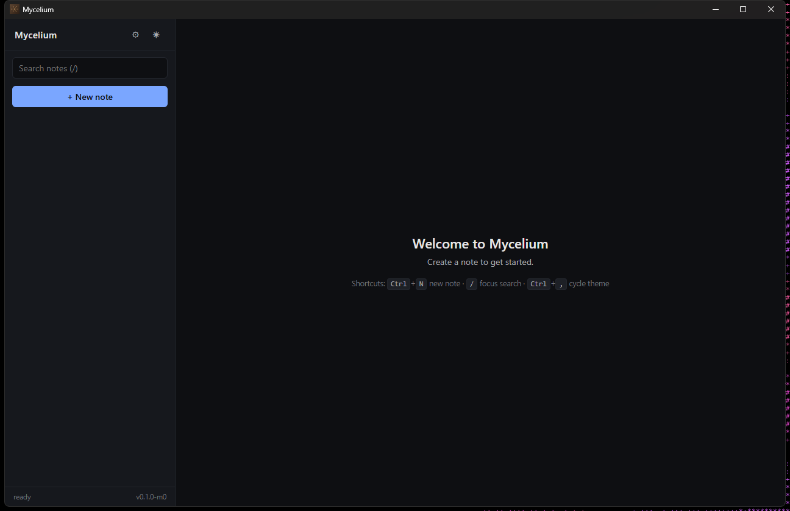
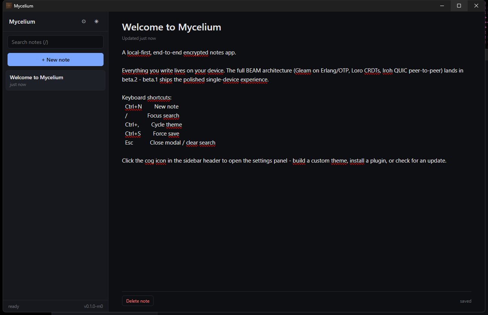
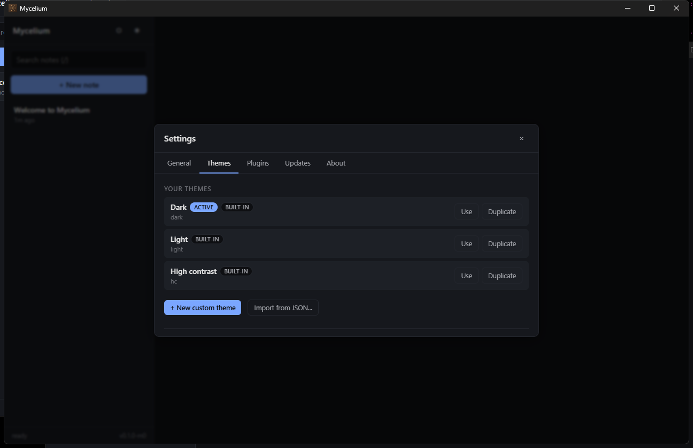
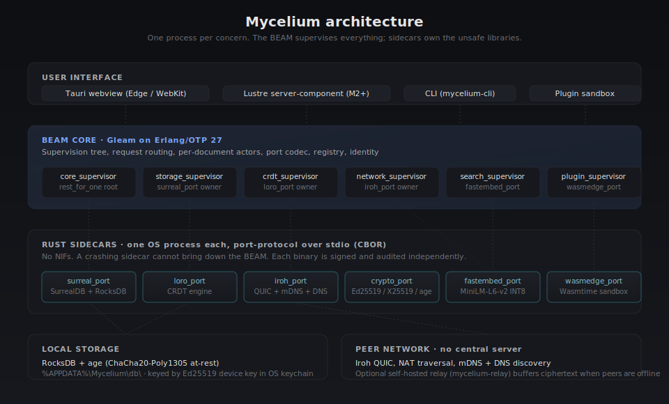

<p align="center">
  
</p>

<p align="center">
  <a href="https://github.com/Arka-ui/mycelium/actions/workflows/ci.yml"></a>
  <a href="https://github.com/Arka-ui/mycelium/actions/workflows/security.yml"></a>
  <a href="LICENSE"></a>
  <a href="https://github.com/Arka-ui/mycelium/releases"></a>
  <a href="https://github.com/Arka-ui/mycelium/releases/latest"></a>
</p>

> **Mycelium** is a local-first, end-to-end encrypted, peer-to-peer collaborative knowledge workspace. Notes, documents, tasks, links, attachments, and structured collections — running on your devices, syncing directly between them over QUIC, with semantic search powered by an on-device language model. The cloud is optional. The system never trusts a third party with your content.

> ### 🌱 [The Mycelium Promise](PROMISE.md)
> Free, open source, and staying that way. No server, no account, no telemetry, no ads, no subscriptions — your notes physically cannot be collected. **[Read the full promise →](PROMISE.md)** (includes an honest disclaimer about forks: the promise binds the *official* version only).

---

## Download

| Platform | File | What you get |
|---|---|---|
| **Windows** | [`Mycelium_0.10.0_x64-setup.exe`](https://github.com/Arka-ui/mycelium/releases/download/v0.10.0-beta.1/Mycelium_0.10.0_x64-setup.exe) (NSIS) or [`.msi`](https://github.com/Arka-ui/mycelium/releases/download/v0.10.0-beta.1/Mycelium_0.10.0_x64_en-US.msi) (WiX) | signed updater |
| **macOS** | [`Mycelium_0.10.0_aarch64.dmg`](https://github.com/Arka-ui/mycelium/releases/download/v0.10.0-beta.1/Mycelium_0.10.0_aarch64.dmg) | Apple Silicon |
| **Linux** | [`.deb`](https://github.com/Arka-ui/mycelium/releases/download/v0.10.0-beta.1/Mycelium_0.10.0_amd64.deb) or [`.AppImage`](https://github.com/Arka-ui/mycelium/releases/download/v0.10.0-beta.1/Mycelium_0.10.0_amd64.AppImage) | x86_64 |
| **Self-hosted relay** (optional) | [`mycelium-relay.exe`](https://github.com/Arka-ui/mycelium/releases/download/v0.10.0-beta.1/mycelium-relay.exe) | Headless ciphertext-buffering relay for VPS hosting |

Verify with [`sha256sums.txt`](https://github.com/Arka-ui/mycelium/releases/download/v0.10.0-beta.1/sha256sums.txt). Full install instructions: [`docs/INSTALLATION.md`](docs/INSTALLATION.md). Newer beta releases ship through the in-app auto-updater, signed with minisign.

---

## What it looks like

<table>
  <tr>
    <td></td>
    <td></td>
  </tr>
  <tr>
    <td align="center"><sub>Welcome screen &middot; sidebar + shortcuts</sub></td>
    <td align="center"><sub>Note editor &middot; auto-save 500&nbsp;ms debounce</sub></td>
  </tr>
  <tr>
    <td colspan="2"></td>
  </tr>
  <tr>
    <td colspan="2" align="center"><sub>Settings → Themes &middot; built-ins + custom palette editor + JSON import/export</sub></td>
  </tr>
</table>

---

## Highlights

- **Local-first.** Notes live as JSON files in `%APPDATA%\Mycelium\notes\`. The app starts in under a second and works fully offline.
- **End-to-end encrypted at rest** (beta.2): age + ChaCha20-Poly1305 keyed by an Ed25519 device key in the OS keychain.
- **Peer-to-peer sync** (beta.2): two devices on the same LAN find each other via mDNS and sync directly over QUIC. Optional self-hosted relay buffers ciphertext when peers are offline.
- **CRDT-backed real-time editing** (beta.2): Loro op log replicates between any pair of devices with strong eventual consistency.
- **On-device semantic search** (beta.3): all-MiniLM-L6-v2 (INT8) runs via fastembed-rs; no query ever leaves your machine.
- **Custom themes.** Ten-colour palette editor + radius/font controls + JSON import/export. Built-in dark / light / high-contrast.
- **Plugin sandbox.** Drop-in JavaScript plugins run in Web Workers with no DOM, no network, no filesystem. Hooks: `note:created / opened / saved / deleted` plus user commands.
- **Signed auto-updater.** Tauri-plugin-updater with minisign verification against the public key baked into your installed app.

---

## Architecture

<p align="center"></p>

Three layers, one process per concern:

1. **Tauri shell** owns the desktop window and supervises the BEAM child.
2. **BEAM core** (Gleam on Erlang/OTP 27) hosts the supervision tree, per-document actors, request routing, identity, and HTTP/WebSocket. Mist + Wisp serve the UI; Lustre runs server-component mode.
3. **Rust sidecars** isolate every "scary" library (CRDT engine, P2P, embedded DB, crypto, embedding model, plugin sandbox) into its own OS process. They speak [a tiny port protocol](docs/protocols/port.md) over stdio so a crash never takes down the BEAM.

The full rationale lives in [`docs/MYCELIUM.md`](docs/MYCELIUM.md). Each major decision has a numbered ADR in [`docs/architecture/`](docs/architecture/).

---

## Roadmap

| Milestone | Status | Scope |
|---|---|---|
| **M0 — Walking skeleton** | beta.1 (current) | Single-device app: notes CRUD, themes, plugins, signed installer, in-app updater. |
| M1 — Local-first MVP | next | Loro CRDTs wired up; two-node sync over Iroh on LAN; Ed25519 device key in OS keychain; SPAKE2 pairing. |
| M2 — Search & plugins | | fastembed-rs + on-device embeddings; SurrealDB vector index; Wasmtime plugin sandbox; three reference plugins. |
| M3 — Production polish | | Reproducible Nix builds; signed-delta updater; 24-hour soak test green; full cross-OS CI matrix. |
| M4 — 1.0 | | External cryptography audit; documentation site; plugin community index. |

Full milestone breakdown: [`docs/MYCELIUM.md` §23](docs/MYCELIUM.md).

---

## Build from source

You only need to do this if you want to hack on the code. End users can skip straight to the [Download](#download) section above.

```powershell
# Windows (PowerShell, no admin required)
scoop install erlang gleam just rebar3 llvm
cargo install tauri-cli --locked

git clone https://github.com/Arka-ui/mycelium
cd mycelium
just build
just dev
```

Linux/macOS use the same `just` recipes (and a Nix flake stub at the repo root). The full toolchain walkthrough — including `LIBCLANG_PATH`, MSVC build tools, and Windows Developer Mode — is in [`docs/SETUP.md`](docs/SETUP.md).

---

## Contributing

```bash
gh issue list                                    # see what is open
gh issue create --template feature_request       # propose something small
gh issue create --template rfc                   # propose an architectural change
```

Read [`.github/CONTRIBUTING.md`](.github/CONTRIBUTING.md) and [`.github/CODE_OF_CONDUCT.md`](.github/CODE_OF_CONDUCT.md) before your first PR. Architectural changes go through the RFC issue template and land as a numbered ADR in [`docs/architecture/`](docs/architecture/). Anything touching `sidecars/loro_port`, `sidecars/iroh_port`, `sidecars/crypto_port`, `sidecars/wasmedge_port`, or `apps/core/src/mycelium/{crypto,identity,network,sync,storage/at_rest}` requires two-maintainer review per the [`CODEOWNERS`](.github/CODEOWNERS) file.

---

## Releases

Tagged versions on `main` trigger [`release.yml`](.github/workflows/release.yml) which builds + signs the bundles for all three OSes in parallel and uploads them to the GitHub Release. See [`CHANGELOG.md`](CHANGELOG.md) for the version-by-version log and [`docs/SECRETS.md`](docs/SECRETS.md) for the one-time signing-secret config (without it, the release workflow falls back to unsigned builds).

---

## Documentation

| Document | Purpose |
|---|---|
| [`docs/MYCELIUM.md`](docs/MYCELIUM.md) | Full technical architecture |
| [`docs/SPECIFICATION.md`](docs/SPECIFICATION.md) | Formal SRS (requirements + acceptance criteria) |
| [`docs/INSTALLATION.md`](docs/INSTALLATION.md) | End-user install (download a release) |
| [`docs/SETUP.md`](docs/SETUP.md) | Toolchain install for contributors building from source |
| [`docs/SECRETS.md`](docs/SECRETS.md) | Configuring the CI signing secrets |
| [`docs/architecture/`](docs/architecture/) | Architecture Decision Records (13 ADRs) |
| [`docs/protocols/port.md`](docs/protocols/port.md) | Port protocol (BEAM ↔ sidecars) |
| [`docs/protocols/wire.md`](docs/protocols/wire.md) | Peer wire protocol (M1 draft) |
| [`docs/plugins/contract.md`](docs/plugins/contract.md) | Plugin contract |
| [`docs/plugins/sdk.md`](docs/plugins/sdk.md) | Plugin SDK reference |
| [`docs/threat_model.md`](docs/threat_model.md) | Threat model |
| [`docs/MAINTAINERS.md`](docs/MAINTAINERS.md) | Governance + maintainer roster |
| [`CHANGELOG.md`](CHANGELOG.md) | Release notes |
| [`.github/SUPPORT.md`](.github/SUPPORT.md) | Where to ask questions, file bugs, propose RFCs |
| [`.github/SECURITY.md`](.github/SECURITY.md) | Vulnerability disclosure policy |

---

## License

The application source is licensed under [**AGPL-3.0-or-later**](LICENSE). The plugin SDK is **MIT** so plugins may be closed-source. Protocol specifications, ADRs, and threat model are **CC-BY-4.0**. Full third-party inventory: [`docs/LICENSES.md`](docs/LICENSES.md).
